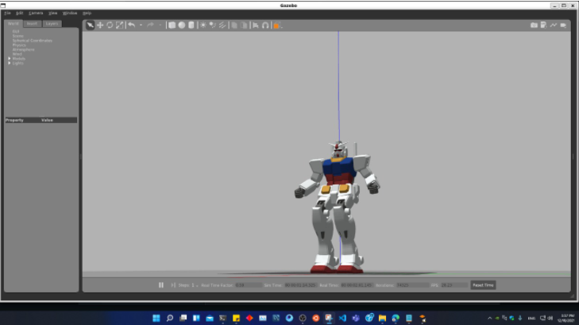
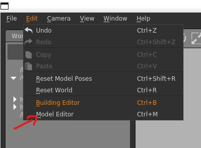
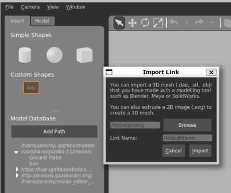
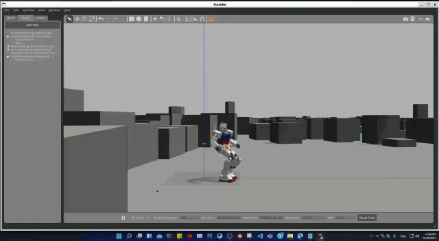

# **Pasos a seguir para que el Robot Gundam camine en la ciudad de Panamá en Windows 11**


## **Paso #1: Instalar WSL**
##### La necesidad de tener intalado el WSL en Windows es para no hacer uso de la sobrecarga de una máquina virtual tradicional o una configuración de arranque dual.si no que en vez de eso instalamos este wsl que es un subsistema de Windos que nos pemitira ejecutar un entorno GNU / Linux, incluidas la mayoría de las herramientas, utilidades y aplicaciones de línea de comandos, directamente en Windows.     Compartimos con ustedes los pasos a seguir en  https://gjenkinsedu.com/post/install_wsl_ubuntu_to_windows_11_0000/ o ver los pasos desde el siguiente video
[](https://www.youtube.com/watch?v=wWFI2Gxtq-8)
___

## **Paso #2: Instalar ROS**
##### -  Aseguremonos de que el índice de su paquete Debian esté actualizado con el comando:
``` 
sudo apt update 
```

##### - Instalación completa en el escritorio: (Recomendado) : todo en el escritorio más simuladores 2D / 3D y paquetes de percepción 2D / 3D  comando:
 ``` 
sudo apt install ros-noetic-desktop-full
```
___


## **Paso #3: Configuración del entorno**
##### - Debe obtener este script en cada terminal de bash en el que use ROS con el comando: 
``` 
source /opt/ros/noetic/setup.bash 
```

##### - Si tiene más de una distribución ROS instalada, solo debe obtener setup.bash para la versión que está utilizando actualmente con :
```
$ echo "source /opt/ros/noetic/setup.bash" >> ~/.bashrc
$ source ~/.bashrc
```
___

## **Paso #4: Dependencias para la construcción de paquetes**
##### - Ahora crearemos y administraremos el espacio de trabajo ROS, una de las herramientas que nos permite hacer esto es rosintall que es la que usaremos
```
sudo apt install python3-rosdep python3-rosinstall python3-rosinstall-generator python3-wstool build-essential
```

___

## **Paso #5: Inicializar rosdep**
##### Rosdep le permite instalar fácilmente las dependencias del sistema para la fuente que desea compilar y es necesario para ejecutar algunos componentes centrales en ROS. Si aún no ha instalado rosdep , hágalo de la siguiente manera.
```
sudo apt install python3-rosdep
```
___

## **Paso #6: para verificar ROS este activo**
``` 
$ source /opt/ros/noetic/setup.bash
$ roscd
```
___

## **Paso #7: Configurar el espacio de trabajo**
##### - Comando para crear carpetas de trabajo y las fuentes ubicarse en $home

```
mkdir workspace
```
```
mkadir src
```

##### - dentro de la carpeta "workspace" que creamos debemos compilar
```
catkin_make
```


##### - Con el siguiente comando debemos de llegar a la ruta "/workspace/devel$"
```
$ source /home/jeremy/workspace/devel/setup.bash
$ roscd
```

##### - Para que tu sesion de usuario siempre encuentre la carpeta y comandos de ros
```
$ cd $HOME
$ echo "source /home/jeremy/workspace/devel/setup.bash" >> .bashrc
```
___

## **Paso #7: Importar Paquete de GUNDAM**
Link Repositorio: https://github.com/gundam-global-challenge/gundam_robot
##### - Debemos movernos a la carpeta src con el comando:
```
cd workspace/src
```
#### -  descargara todo el paquete de GUNDAM en src 
```
git clone https://github.com/gundam-global-challenge/gundam_robot.git
```
#### - ubicarse en workspace para compilar
```
catkin_make
```
#### -luego si salen errores de dependencias instalar todos esos paquetes de dependencia en src

##### - importar ROS controller
```
$ cd src
$ git clone https://github.com/ros-controls/ros_controllers.git
```
link: https://github.com/ros-controls/ros_controllers
___

## **Paso #8: Importar URDF_Geometry_Parser**
<!-- #### - Importar URDF_Geometry_Parser -->
```
$ cd src`
$ git clone https://github.com/ros-controls/urdf_geometry_parser.git>
```
link: https://github.com/ros-controls/urdf_geometry_parser`
___

## **Paso #9: Importar Four_wheel_steering**
<!-- #### - Importar Four_wheel_steering -->
```
$ cd src`
$ git clone https://github.com/ros-drivers/four_wheel_steering_msgs.git
```
Link: https://github.com/ros-drivers/four_wheel_steering_msgs.git`
#### - luego en workspace 
```
catkin_make
```
#### - debera compilar al 100% cuando tengan todas las dependencias instaladas


## **Paso #10: Iniciar simulacion!!!**
```
$ roslaunch gundam_rx78_gazebo gundam_rx78_walk.launch
```



## **Paso #11: Importar mapa de la ciudad de Panamá en 3D**

#### - Luego add para buscar nuestro archivo del mapa de Panama modelado en 3D


## **Paso #12: Comandos para que Guandam de pasos**
###  Mientras el simulador está corriendo, en una ueva terminar se puede proceder a ejecutar los siguientes comandos que desee:

#### - Caminar hacia adelante
```
$ rosrun gundam_rx78_control joint_trajectory_client_csv.py `rospack find gundam_rx78_control`/sample/csv/walk-forward.csv
```

#### - Caminar hacia atras
```
$ rosrun gundam_rx78_control joint_trajectory_client_csv.py `rospack find gundam_rx78_control`/sample/csv/walk-backward.csv
```

#### - Moverse a la derecha
```
$ rosrun gundam_rx78_control joint_trajectory_client_csv.py `rospack find gundam_rx78_control`/sample/csv/walk-to-right.csv
```

#### - Moverse a la izquierd
```
$ rosrun gundam_rx78_control joint_trajectory_client_csv.py `rospack find gundam_rx78_control`/sample/csv/walk-to-left.csv
```

#### - Girar a la derecha
```
$ rosrun gundam_rx78_control joint_trajectory_client_csv.py `rospack find gundam_rx78_control`/sample/csv/turn-right.csv
```

#### - Girar a la izquierda
```
$ rosrun gundam_rx78_control joint_trajectory_client_csv.py `rospack find gundam_rx78_control`/sample/csv/turn-left.csv
```


## **Paso #13: Gundam Dando sus primeros pasos en la ciudad de Panamá**



